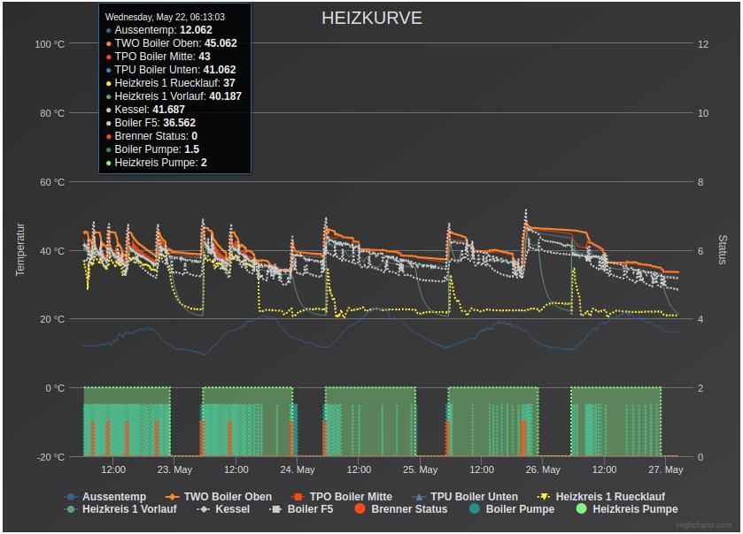
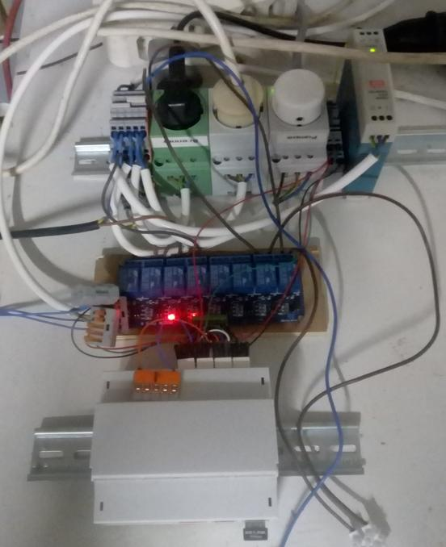

# Smart Heating System for Raspberry Pi

#### v0.1

This package contains a **heating system** for the [Raspberry Pi](https://www.raspberrypi.org/), implemented with the [Go Programming Language](https://golang.org/). The system can be deployed to buildings that have a central heating infrastructure in order to control warming of *water supply* and *radiator circuits*.

The system was designed to obtain deeper control of the heating process by learning (behavior of the building's heating infrastructure, habits of the residents, other external components like solar panels, weather forecasts/developments, etc.) and custom parameter settings/preferences (time, temperature, etc.). Thus it can be used to increase comfortability and/or reduce costs and amount of energy that is required for warming the building.

The system is still under development (code changes may likely occur in future versions).
***





***
## Contents
* [Features](#features)
* [Internal Components](#internal-components)
  * [Oracles](#oracles)
  * [Learners](#learners)
  * [Agents](#agents)
  * [Logger](#logger)
  * [System Environment](#system-environment)
* [Setup](#setup)
  * [Hardware Requirements](#hardware-requirements)
  * [Software Requirements](#software-requirements)
  * [Installation](#installation)
***

## Features
### Current
+ sensor data validation mechanism
 + redundant temperature lookups to increase response time and identify byzantine sensor behavior
 + validation checks to handle corrupted sensor data by electromagnetic interference
+ agents interface to easily develop and add new heating agents
+ hardware interface to easily adjust the system for usage with different environments/infrastructures, other settings and map [GPIO pins](https://www.raspberrypi.org/documentation/usage/gpio/) via a relay board to real-world components like:
 + binary components (pumps, burners, triangle valves, ...)
 + continuous components (frequency converters for pumps)
+ configuration interface for human interaction and fast system adjustments
+ data logging for web-based system state visualization
+ error logging for easy debugging

### Planned/Future
+ consensus protocol for more robust data validation
+ user access to the system configuration via graphical interface (web-based)
+ remote procedure calls to enable distributed components
+ additional learners and models
+ data labeling api for supervised machine learning approaches
+ enhanced configuration api with protocol buffers (switch from simple table to more sophisticated method)
+ rewarding system to enable reinforcement learning

***

## Internal Components

### Oracles
Provide services to other internal system components like agents, learners, loggers or the system environment itself in a server/client relationship. Clients send requests and obtain data responses (like current percepts, system configuration, average temperature data, temperature deltas, etc.) from oracles. By invariant the responded data is always valid.

1. *Percept_Oracle* handles temperature/percept queries and responds with current temperature data.
⋅⋅⋅A sliding window is established to keep track of the temperature development as the system is running over time. This enables the oracle to also responds to more complex queries like mean temperature or temperature deltas over a defined period.
2. *Configuration_Oracle* handles system configurations queries.
⋅⋅⋅Basically this oracle is queried by agents in order to obtain the current target temperatures for the heating system that is provided by the user via configuration. Therefore, it serves as interface between the user and the agents. The user provides a configuration with target values (*csv formated table*) via the `./filesystem/heating_config/config.csv` path and the oracle responds to agent requests according to it.

### Learners
Provide insights about the heating system, buildings infrastructre, expected responses to actions and residents' habits. Especially for planning agents it is essential to establish some knowledge about the stochastic environment the heating system lives in.

1. *waterConsumptionLearner* classifies temperature developments of the warm water boiler and provides predictions of current requirement for warm water in the building.
⋅⋅⋅Applies an unsupervised clustering method (K-Means) in order to classify temperature developments (temperature deltas between successive points in time). Agents can obtain the likelihood of the requirement for warm water and can use this information to schedule the heating of the water boiler.

### Agents
Provide an interface to easily adjust the system's behavior. Agents implement the heating strategy and return an action given the current temperature data. Internally agents can keep track of their own system state representations, can query oracles and learners to obtain additional data and information about the system environment.

### Logger
Connects a database, creates the required database tables, and writes the data (percepts, actions, states) to disk.

### System Environment
Initializes all hardware components, oracles, learners, agents and loggers, and establishes the required channels in order to enable request/response communication between these components. The system environment also implements the main loop and carries out the actions that have been computed by agents. In order to prevent the system from overheating, additional security checks are implemented that are checked before the actions are carried out. Additional tasks:
+ compute and reward agents for their actions -> reinforcement learning
+ log data and errors
+ carry out cleanup of resources when the program finishes
+ implement the logical setup of hardware components, wiring and temperature sensor mappings

***

## Setup

### Hardware Requirements

Component | Type | Quantity | Additional Information
--- | --- | --- | ---
Raspberry Pi | B+ | 1 | Remote access via [ssh](https://help.ubuntu.com/lts/serverguide/openssh-server.html.en) over ethernet or wifi is recommended.
W1 temperature sensors | DS18B20 | 9 | Depends on the configuration of the `system.Percept` struct. Logical assignment is currently implemented in `go_heating.go` but may be moved to an external configuration file in the future.
High current relay shield | 5V/230V | 4-8 channels | The relay number depends on the number of hardware components that need to switched. The mapping of GPIO pins to relay channels is implemented in `go_heating.go`. See this post for information on [how to wire the relay board.](https://www.raspberrypi.org/forums/viewtopic.php?t=36225)

### Software Requirements
* [MySQL database server](https://help.ubuntu.com/lts/serverguide/mysql.html.en) - Ensure user `heating_logger` has (r/w) access to empty database named `heating_controller`. Default password is `heating`. All these parameters can be changed in `go_heating.go` file.
* [Git](https://git-scm.com/downloads)
* [Go Programming Language v1.12.5](https://golang.org/doc/install)
* [Go-MySQL-Driver v1.4.1](https://github.com/go-sql-driver/mysql/releases/tag/v1.4.1) (tested with commit [`877a977`](https://github.com/go-sql-driver/mysql/commit/877a9775f06853f611fb2d4e817d92479242d1cd))

### Installation

Install the package to your [$GOPATH](https://github.com/golang/go/wiki/GOPATH) using the [go tool](https://golang.org/cmd/go/) by the following shell command:

```bash
$ go get -u github.com/hansen1101/go_heating
```

#### Fix incompatible version of Go-MySQL-Driver (optional)

This command will also download the required dependencies (i.e., latest version of Go-MySQL-Driver). If this version is not compatible, try to checkout commit `877a977` an reinstall the system with:

```bash
$ go install github.com/hansen1101/go_heating
```

#### Connect heating system to *w1 bus* and *GPIO* via `./filesystem`
The subdirectory `./filesystem` can be used for managing deployments in different environments (test as well as production).
Please make sure that the following directory structure exists through symbolic links (referenced from the `go_heating/` root directory):

+ `./filesystem/sys/bus/w1 -> /sys/bus/w1/`
+ `./filesystem/sys/class/gpio -> /sys/class/gpio/`

Without this structure a productive system would be unable to access sensor data and actuators.
For testing purposes, change the symbolic link to point to `./test/sys/bus/w1/` as well as `./test/sys/class/gpio/` subdirectories.

Change into the packages root directory in order to execute the following commands:
```bash
$ cd $GOPATH/src/github.com/hansen1101/go_heating
```

##### Linux command for test environment:
```bash
$ ln -rs ./test/sys/bus/w1 ./filesystem/sys/bus/w1
$ ln -rs ./test/sys/class/gpio ./filesystem/sys/class/gpio
```

##### Linux command for productive environment:
```bash
$ ln -rs /sys/bus/w1 ./filesystem/sys/bus/w1
$ ln -rs /sys/class/gpio ./filesystem/sys/class/gpio
```

### Execution

An executable called `go_heating` should be available in the directory `$GOPATH/bin`. To run the heating system call:
```bash
$ $GOPATH/bin/go_heating
```
